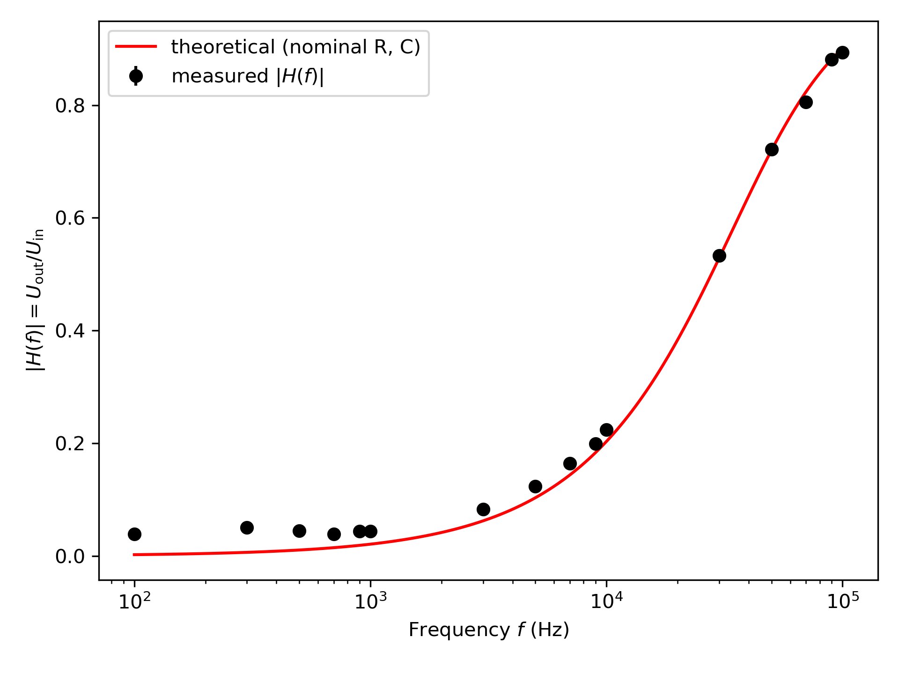

# E1e Lab Report

This folder contains my work for the E1e physics lab experiment, including the final lab report, analysis notebook, generated plots, and selected setup images.

The goal of this folder is to make the experiment easier to understand than a standalone PDF report by showing the analysis workflow and the main figures separately.

## Preview

## Contents

| Folder | Description |
|---|---|
| `report/` | Final lab report PDF |
| `notebook/` | Jupyter notebook used for calculations, plotting, and analysis |
| `plots/` | Figures generated during the data analysis |
| `images/` | Selected photos of the experimental setup |

## Main files

| File | Description |
|---|---|
| [`report/E1e.pdf`](report/E1e.pdf) | Final submitted lab report |
| [`notebook/E1e.ipynb`](notebook/E1e.ipynb) | Jupyter notebook containing the analysis workflow |

## Plots

| Plot | Description |
|---|---|
| [`plots/task1_series_V_vs_R.png`](plots/task1_series_V_vs_R.png) | Plot for the task 1 series circuit analysis |
| [`plots/task1_parallel_I_vs_invR.png`](plots/task1_parallel_I_vs_invR.png) | Plot for the task 1 parallel circuit analysis |
| [`plots/task2_UL_vs_RL.png`](plots/task2_UL_vs_RL.png) | Plot for the task 2 load-voltage analysis |
| [`plots/task2_UoverUL_vs_invRL.png`](plots/task2_UoverUL_vs_invRL.png) | Plot for the task 2 reciprocal relationship analysis |
| [`plots/task3_UB_vs_R4_fit.png`](plots/task3_UB_vs_R4_fit.png) | Plot and fit for the task 3 circuit analysis |
| [`plots/task4_transfer_HP_measured_vs_theory.png`](plots/task4_transfer_HP_measured_vs_theory.png) | Measured and theoretical transfer function for the task 4 high-pass filter analysis |

## Skills demonstrated

- Experimental circuit measurements
- Python-based data analysis
- Jupyter notebook workflow
- Plotting and curve fitting
- Comparison between measured and theoretical behaviour
- Scientific report writing
- Organizing lab work in a reproducible format

## Reproducibility

The main analysis is contained in `notebook/E1e.ipynb`. The notebook includes the calculations, plots, and fitting steps used for the experiment.

At the moment, the measurement values are stored inside the notebook rather than as separate CSV files. A future improvement would be to extract the measurement tables into separate cleaned CSV files inside a `data/` folder.

## Notes

This repository is intended as a portfolio record of my physics lab work. It is not meant to replace official course material or lab instructions.
